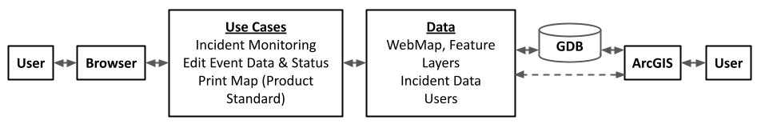
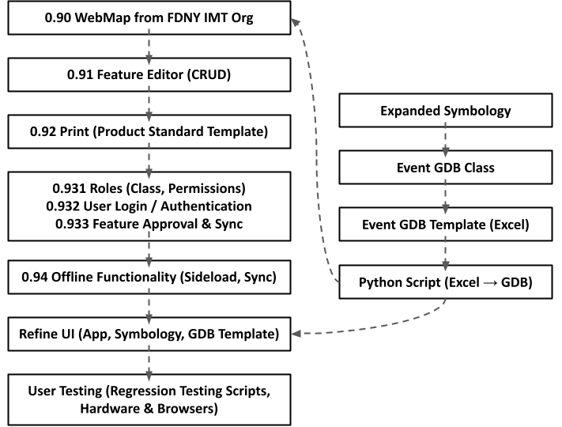

IMT-GIS-Tools
================

<!-- WARNING: THIS FILE WAS AUTOGENERATED! DO NOT EDIT! -->

# All-Hazard IMT Web Mapping Application

## Executive Summary

All-hazard incident management teams (AHIMT) are often tasked with
responding to and managing incidents of wildly varying scope and
complexity. The role of AHIMTs continues to evolve into a more data
centric role due to legal issues, incident complexity, and
interoperability requirements. These challenges necessitate a framework
for managing geospatial data during incident assignments. Currently no
standards exist specific to geospatial data management for AHIMTs like
there is for the wildland fire community (NWCG<!-- Todo: add link -->).
To that end, we propose the following solution: 1. Standardized event
geodatabase (EGDB) schema. 2. Pre-built web-apps, map layouts, and
analysis tools that match schema. 3. Tools to allow adapting framework
to mission requirements with minimal training. 4. Standard operating
procedures (SOP) that defines operational procedures for handling
geospatial data and associated products.

The above will allow teams to quickly establish methods for capturing,
analyzing, and visualizing data while providing the flexibility required
to adapt to changing situations.

## Discussion

### Event Geodatabase

- Excel spreadsheet template for incident-specific event geodatabase
- Python script to create/update/import incident-specific geodatabase to
  ArcGIS from template
- Expanded incident event symbology based on core of US&R template and
  NWCG event geodatabase \### Web Application
- Incident monitoring
- Create, read, update, and delete (CRUD) event data
- Print format-customizable maps at product (e.g., NWCG) standard
- Permissions for query/approval based on IMT roles (GISS, SITL, IC,
  etc.)
- Input features based on hand-held data collection (ESRI Field Maps)
- Functional across common hardware and browsers
- Offline functionality with source feature service synchronization of
  edits

### Custom ArcGIS Pro Templates and Map Layouts

- ArcGIS Pro template containing
  - EGDB
  - Custom toolbox
  - Customizable map layouts
- May layouts
  - Customizable for organizational use
  - Customizable to map/product requirements
  - Dynamic text for rapid updating of map info

### Analysis Tools

- Custom Python tools to accomplish (not all inclusive)
  - ✅ Export all layouts in project
  - Start up/join/shutdown an incident
  - Create ready state AGOL deployment

## Architecture Overview

Users: As referenced in the figure above, users will be able to interact
with the web application both from the browser and via the ArcGIS
product suite. All users will be able to interact with the web
application through the browser UI. Certain roles (e.g., GISS) will be
responsible for “behind the scenes” work via ArcGIS. This will include
setting up the event geodatabase (GDB), collecting field data, and
maintaining the instanced web map in AGOL.

Browser: The core application UI (“the incident map”) runs on the web
browsers of IMT hardware. The application will be designed to work
offline, with synchronization occurring after reconnecting to the
internet or via sideloading.

Use Cases: The core uses of the map application. Includes: monitoring of
the incident by the IC and relevant parties (SITL, etc.), user-friendly
contributions and updates to map features (including the ability to
gate-keep updates behind a permission-based approval workflow), and a
printing function that produces maps at desired sizes, formats, and
product standards.

Data: The data used by the application in performance of its functions.
Includes but is not limited to the instanced WebMap from ArcGIS,
presumably specific to a given incident, feature layers included in or
viewed separately (e.g., NYC’s PLUTO) from the instanced WebMap,
user-generated incident data consistent with the GDB, and users. The
users class will include a role property from which certain app
functionality will be restricted.

GDB: The incident-customizable event geodatabase, generated from an
Excel spreadsheet template maintained by the GISSs and other applicable
users.

ArcGIS: The ESRI product suite, including ArcGIS Pro, AGOL, and Field
Maps.

## Implementation Plan

1.  Load a WebMap from AGOL and feature layers from other data sources
    (e.g., PLUTO) for development purposes. WebMap will eventually
    include the custom .gdb as created from an Excel template and
    accompanying python script.

2.  Include an editor that will add, delete, and edit features. Choose
    appropriate UI for the widget that displays name and symbology of
    features in the gdb organized by data type (point, line, polygon) or
    ‘genre’ (e.g., wildfire, collapse, etc.).

3.  Develop a printing widget that exports the browser view at
    predetermined and custom sizes and file formats. The widget should
    have a toggle (default) that specifies the map be produced in
    accordance with SOPs.

4.  Define a user class, including roles and permissions. To include but
    not limited to: Owner, IC, SITL, Logistics, GISS, View-Only. Create
    a process for managing users. Include web app login and
    authentication. Develop a feature approval workflow. At minimum,
    this should include an “Approval Workflow” based on the National
    Incident Feature Service Workflows.

5.  Build an offline version of the application that is to be sideloaded
    onto mobile devices. Feature edits in the offline application should
    write to the “main” map pending role-based approval.

6.  Refine all aspects of the user experience, including but not limited
    to the expanded symbology, the Event GDB template, and the web
    mapping application. The software should be user-friendly to those
    with limited technological familiarity. Procure and act upon
    feedback from expected users.

7.  Develop regression testing scripts to be performed after software
    updates. The scripts should capture the full functionality of the
    software, including updates/modifications to the event GDB and
    synchronizing with offline devices.

## Current Status

- Event GDB: [event_gdb/README.md](event_gdb/README.md)

- Webapps: [webapp/README.md](webapp/README.md)

- ## Changelog

  ### 2022-08-31

- Add event GDB readme: [event_gdb/README.md](event_gdb/README.md)

- Add webapp readme: [webapp/README.md](webapp/README.md) \###
  2022-08-11

- Alpha version of event GDB ready

- Still in conversations with ESRI on how to best adapt the
  domains/contingent values of feature category after EGDB has been
  pushed to AGOL

- Basic webapp running

- SOP stub created

- Some layout management tools completed
